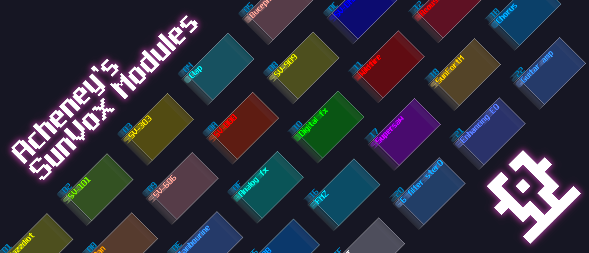

# Story
Since acheney is currently taking a break on SunVox, and his content is currently unavailable; he decided to pass his creation to me and help him to share his cool little module collection, so here it is, his module is now once again available for everyone.

They are all MIT licensed, so you can use and modify freely as you want. In fact, I decided to help him to update some of the modules since I find many of them have some merits, but they are a bit old and the control can be further simplified so that beginners can use them easily. Thus, stay tune, and soar beyond! Hopefully, I can make some great update with his collection, or if you have some neat update for the module, feel free to submit a pull request or found me in the SunVox discord group.

# abstract (original by acheney)

here are all the sunvox modules i've made. they are sorted based on sunvox's own module library. documentation can be found here: https://acheney.xyz/sunvox/modules/docs

to get the modules, simply clone this repo, move the archive to sunvox's root directory, and tell your file manager to merge the directories

these require at least version 2.1 for full functionality

